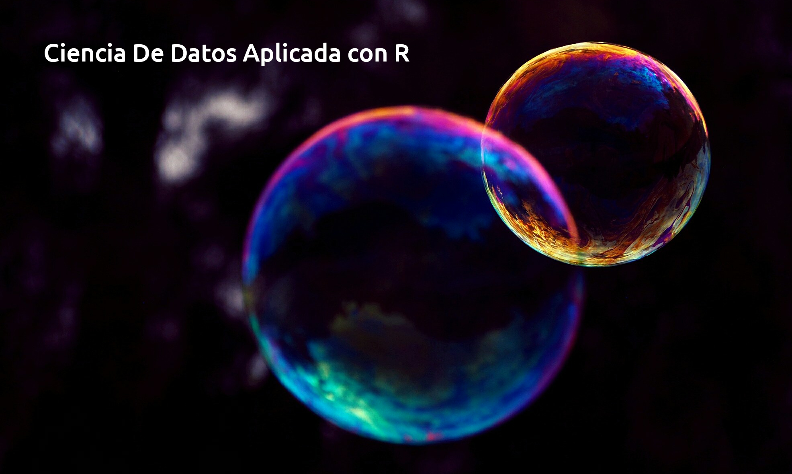

# OPR319-Ciencia-de-datos-con-R
Curso dictado en el programa de Sociología en la Universidad Católica del Maule

El propósito de este curso es introducir a los estudiantes en las herramientas básicas para extraer información valiosa a partir de datos sin procesar. A menudo, generados fuera de los tradicionales diseños de investigación científica. En específico, el curso busca establecer una base sólida para dominio de las herramientas necesarias en Ciencia de Datos, utilizando R y Tidyverse, un conjunto de software estadístico de código abierto, ampliamente reconocido en la investigación tanto académica como aplicada. El curso aborda cada etapa del proceso de manipulación y análisis de datos, que incluye; importación de datos, limpieza, transformación, validación, visualización, modelado y creación de informes automáticos y reproducibles. Al finalizar, los estudiantes serán capaces de analizar bases de datos de complejidad intermedia a avanzada.
